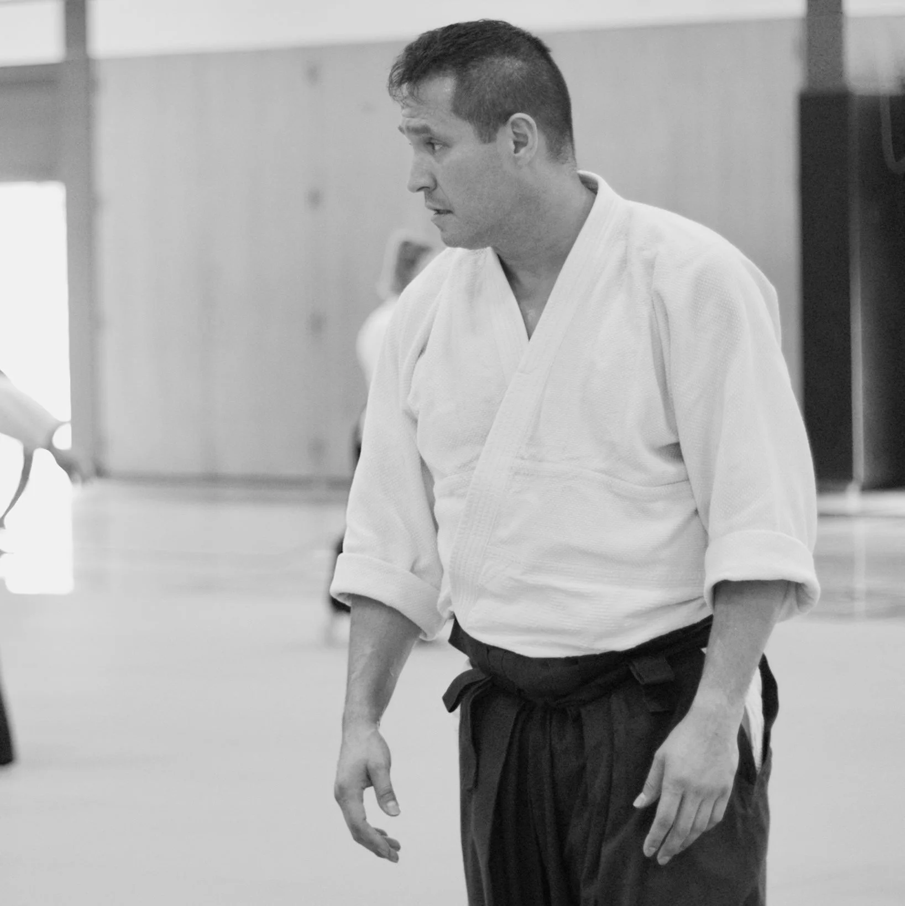
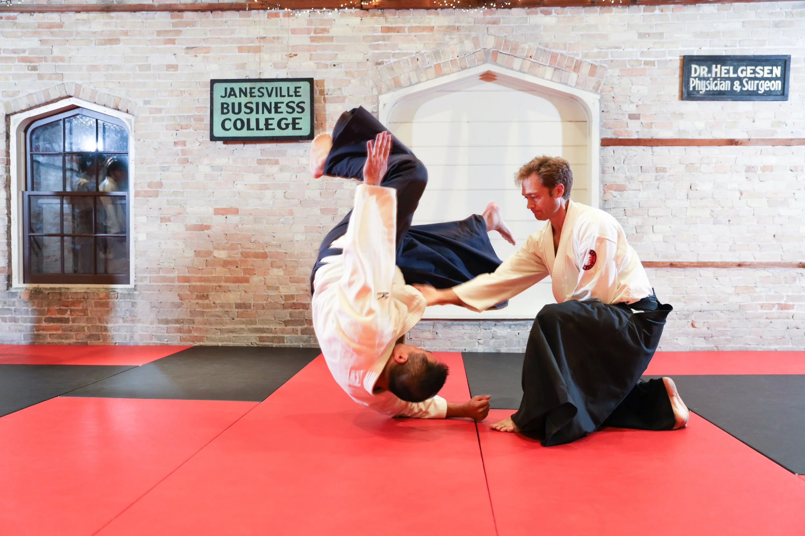
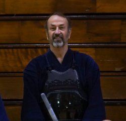

```{=html}
<div class="about-page">

  <h2 class="about-section-title">Our Instructors</h2>

  <!-- Erwin Lares -->
  <div class="instructor-tile">
    <div class="instructor-image">
      
    </div>
    <div class="instructor-text">
      <h3>Erwin Lares</h3>
      <p>
        Erwin Lares started aikido in 1994 with Emmanuel Herzog shihan and
        Nelson Requena shihan in Caracas, Venezuela. After relocating to the
        Midwest in 2002, he rediscovered aikido, first with Von Glockner sensei
        in Rockford, IL, and finally with Leonard sensei in Harvard, IL, with
        whom he has trained for the last 15 years.
      </p>
      <p>
        Over the years, Lares sensei has traveled extensively to various dojos
        and organizations to train with different aikido practitioners. He is
        dedicated to improving his skills and gaining new experiences by
        embracing the lessons offered by diverse people and perspectives.
      </p>
      <p>
        Lares sensei holds a 4th degree black belt from Hombu Dojo, Japan.
      </p>
    </div>
  </div>

  <!-- Scott Johnson -->
  <div class="instructor-tile">
    <div class="instructor-image">
      
    </div>
    <div class="instructor-text">
      <h3>Scott Johnson</h3>
      <p>
        Scott Johnson began learning aikido in 2002 with MIT's Kokikai club in
        Cambridge, MA, under David Comi, Jay Rifkin, and EBeth Haley. After
        four years he moved to New Orleans for graduate school and started and
        led the Tulane University aikido club. Over the next decade, he traveled
        for work and practiced for extended periods with Aikikai, Seidokan, Ki
        Society, Aikido Schools of Ueshiba, and other styles of aikido.
      </p>
      <p>
        From 2018 to 2025, he led Edgerton Aikido, which has been folded into
        Capital Aikikai of Wisconsin. He travels as often as he is able to
        regional seminars and national camps.
      </p>
      <p>
        Johnson sensei holds a 2nd degree black belt from Aikido Kokikai.
      </p>
    </div>
  </div>

  <!-- Rick Helmeid -->
  <div class="instructor-tile">
    <div class="instructor-image">
      
    </div>
    <div class="instructor-text">
      <h3>Rick Helmeid</h3>
      <p>
        We're honored to welcome Rick Helmeid, sensei of the Kurotaka Kendo
        Club (Edgerton, WI), to lead our Iaido classes. Rick has practiced
        Kendo since 1989 and holds a Sandan (3rd-degree) rank with the
        All-United States Kendo Federation and Midwest Kendo Federation. In
        addition to Kendo, Rick offers instruction in Iaido and Jodo (the way
        of the stick).
      </p>
      <p>
        He is a founding member of the UW–Madison Kendo Club under the late
        Sensei Minoru Kiyota (Professor Emeritus in Buddhist Studies). Rick has
        competed at regional and national tournaments and has participated in
        numerous seminars and tournaments.
      </p>
      <p>
        He also holds a Master's Degree in English (UW–Whitewater) with an
        emphasis on developing Kendo curriculum for middle and high school
        students.
      </p>
    </div>
  </div>

  <!-- Contact form -->
  <div class="contact-section">
    <div class="contact-intro">
      <h2>Contact Us</h2>
      <p>You have questions? Get in touch with us. We'll do our best to answer them.</p>
    </div>
    <div class="contact-form-wrapper">
      <form name="contact" method="POST" data-netlify="true" netlify-honeypot="bot-field">
        <input type="hidden" name="form-name" value="contact">
        <p class="hidden">
          <label>Don't fill this out: <input name="bot-field"></label>
        </p>
        <div class="form-row">
          <div class="form-group">
            <label for="first-name">First Name <span class="required">(required)</span></label>
            <input type="text" id="first-name" name="first-name" required>
          </div>
          <div class="form-group">
            <label for="last-name">Last Name <span class="required">(required)</span></label>
            <input type="text" id="last-name" name="last-name" required>
          </div>
        </div>
        <div class="form-group">
          <label for="email">Email <span class="required">(required)</span></label>
          <input type="email" id="email" name="email" required>
        </div>
        <div class="form-group">
          <label for="message">Message <span class="required">(required)</span></label>
          <textarea id="message" name="message" rows="6" required></textarea>
        </div>
        <button type="submit" class="btn-cta">Send</button>
      </form>
      <script>
        (function () {
          var form = document.querySelector('form[name="contact"]');
          var wrapper = document.querySelector('.contact-form-wrapper');

          function encode(data) {
            return Object.keys(data)
              .map(function (key) {
                return encodeURIComponent(key) + '=' + encodeURIComponent(data[key]);
              })
              .join('&');
          }

          form.addEventListener('submit', function (e) {
            e.preventDefault();

            var formData = new FormData(form);
            var payload = {};
            formData.forEach(function (value, key) { payload[key] = value; });

            fetch(window.location.pathname, {
              method: 'POST',
              headers: { 'Content-Type': 'application/x-www-form-urlencoded' },
              body: encode(payload)
            })
              .then(function (response) {
                if (!response.ok) { throw new Error('Form submission failed'); }
                wrapper.innerHTML = '<p class="form-success">Thanks for reaching out — we\'ll get back to you soon.</p>';
              })
              .catch(function () {
                wrapper.insertAdjacentHTML(
                  'beforeend',
                  '<p class="form-error">Something went wrong. Please email us directly at info@aikidoofwisconsin.com.</p>'
                );
              });
          });
        })();
      </script>
    </div>
  </div>

</div>
```
