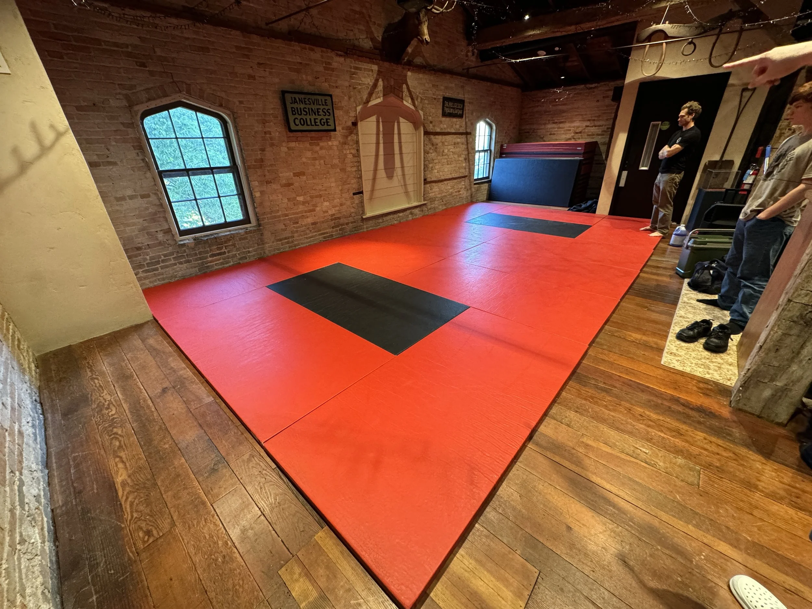
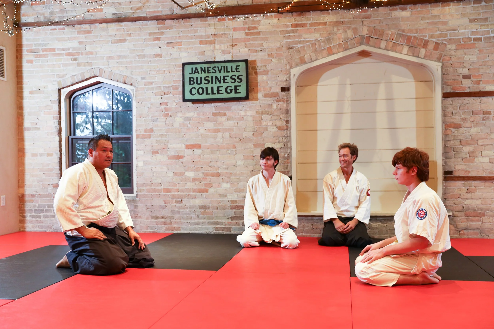
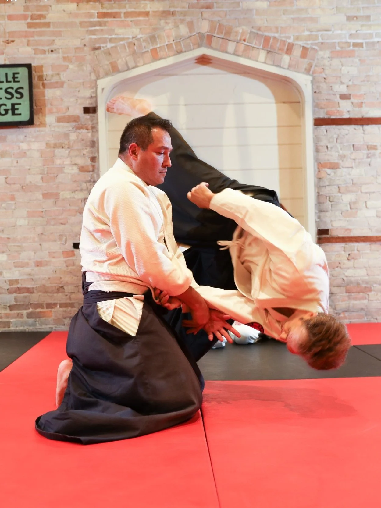
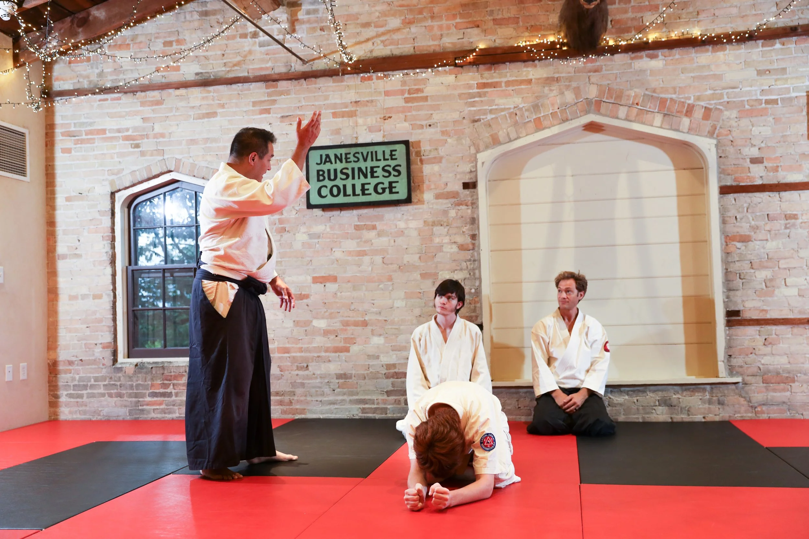
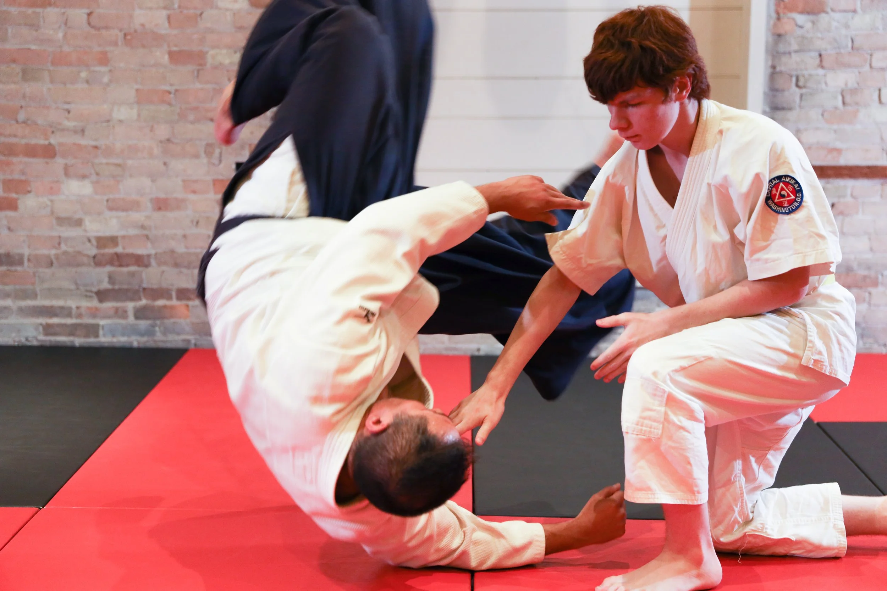
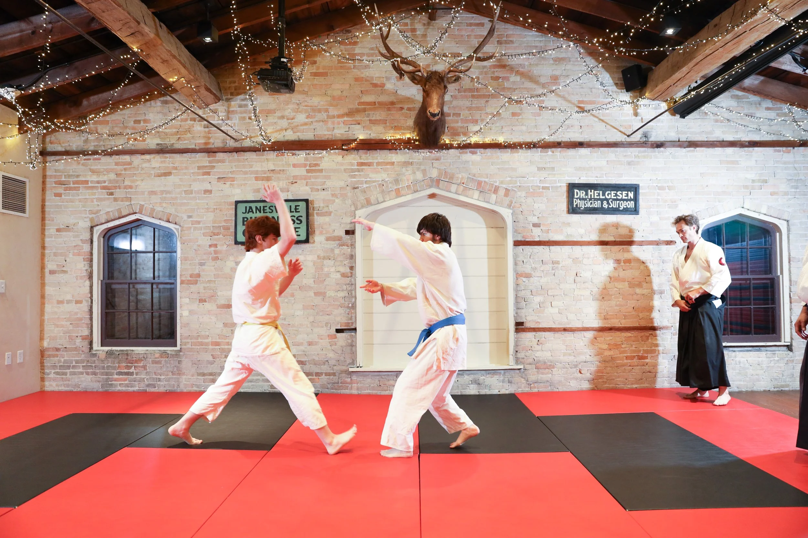
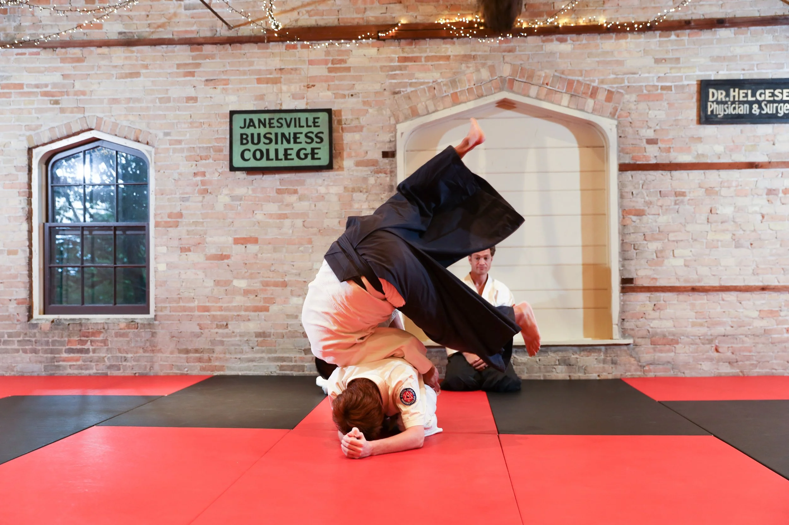
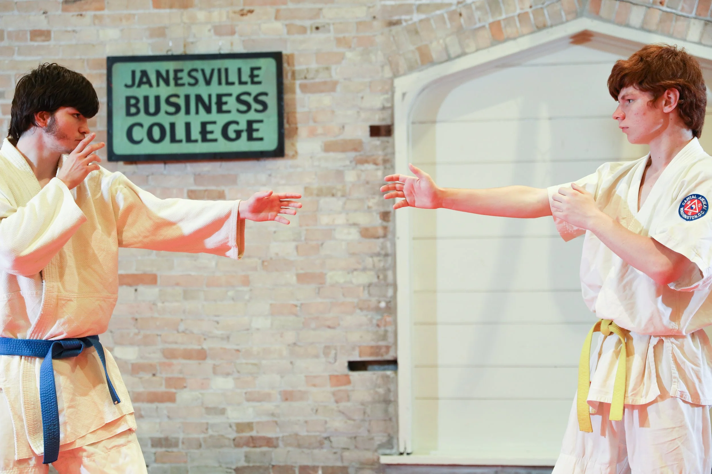

A couple of weeks ago, I got access to the facility that will become our dojo come October 16th. Yup, hard to believe but we have an official day to open the doors of Capital Aikikai of Wisconsin. 

I feel very grateful for the Wolfs (Wolves?) who came to help me all the way from Harvard and Scott Johnson from Aikido of Edgerton. They all generously volunteered their time to help me figure out how to best utilize the space. 

We found the layout that works for the space. (It's tiny!) We managed to fit 14 tatami on the north side of the building. I think it would comfortably accommodate half a dozen people, which is incredibly optimistic. If more people join, we might have to also use the central portion of the room to accommodate the additional bodies. 

{#fig-id width="500px" height="375px" fig-align="center" fig-alt="A group of people looking at the tatami mats"}

After cleaning the mats for the first time, we had a short class where we practice some kihon waza. At the very end gave tried ukemi for koshinage a try. We have a long way to go!

::: {.photo-grid}
{.lightbox group="informal-first-class" fig-alt="Pictures from the first time we laid the mats down at"}
{.lightbox group="informal-first-class" fig-alt="Pictures from the first time we laid the mats down at"}
{.lightbox group="informal-first-class" fig-alt="Pictures from the first time we laid the mats down at"}
{.lightbox group="informal-first-class" fig-alt="Pictures from the first time we laid the mats down at"}
{.lightbox group="informal-first-class" fig-alt="Pictures from the first time we laid the mats down at"}
{.lightbox group="informal-first-class" fig-alt="Pictures from the first time we laid the mats down at"}
{.lightbox group="informal-first-class" fig-alt="Pictures from the first time we laid the mats down at"}
:::

