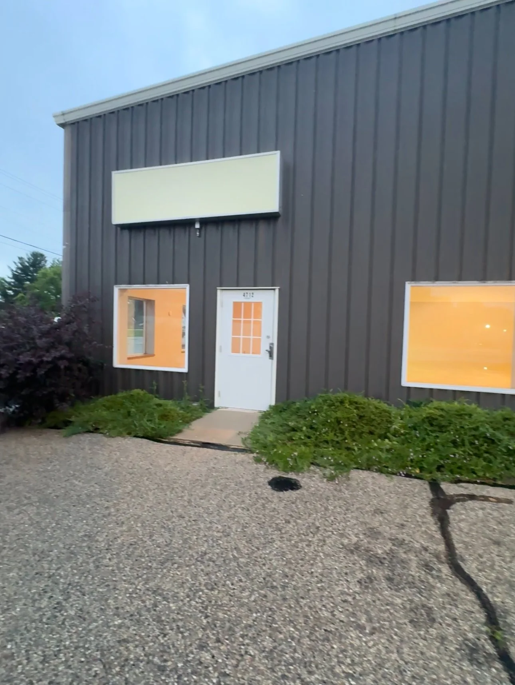

If you’ve been following my efforts to bring Aikido to the Janesville area, you probably know that our attempt to launch the dojo in October 2024 was, unfortunately, a complete flop.

To this day, I’m not entirely sure why the Rock County Historical Society backed out of our collaboration and canceled the project just two weeks before it was set to begin. I was never given a satisfactory explanation—and at this point, I think it’s pointless to keep looking for one.

I can’t overstate how demoralizing that was. I spent most of 2024 setting things up properly: I registered the dojo as a legal entity in Wisconsin, established it as a 501(c)(3) nonprofit organization, purchased mats, and handled countless other preparations.

Thankfully, this story has a happy ending. At the end of January this year, the Capital Aikido Federation expressed interest in helping me get the dojo off the ground. That renewed hope led to a fresh search for a space, along with new business plans and proposals.

I’m happy to share that this week, we signed a lease for a beautiful open space that will become our dojo’s new home. It’s just a few minutes off the Highway 26 interstate exit. The space has high ceilings, plenty of room—and no columns!

{fig-alt="A photo of the building right after we took the lease"}
