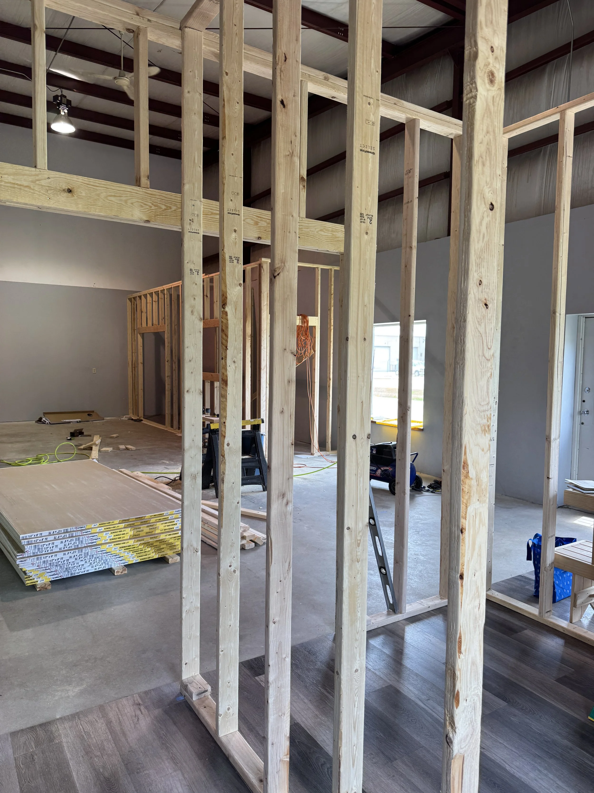
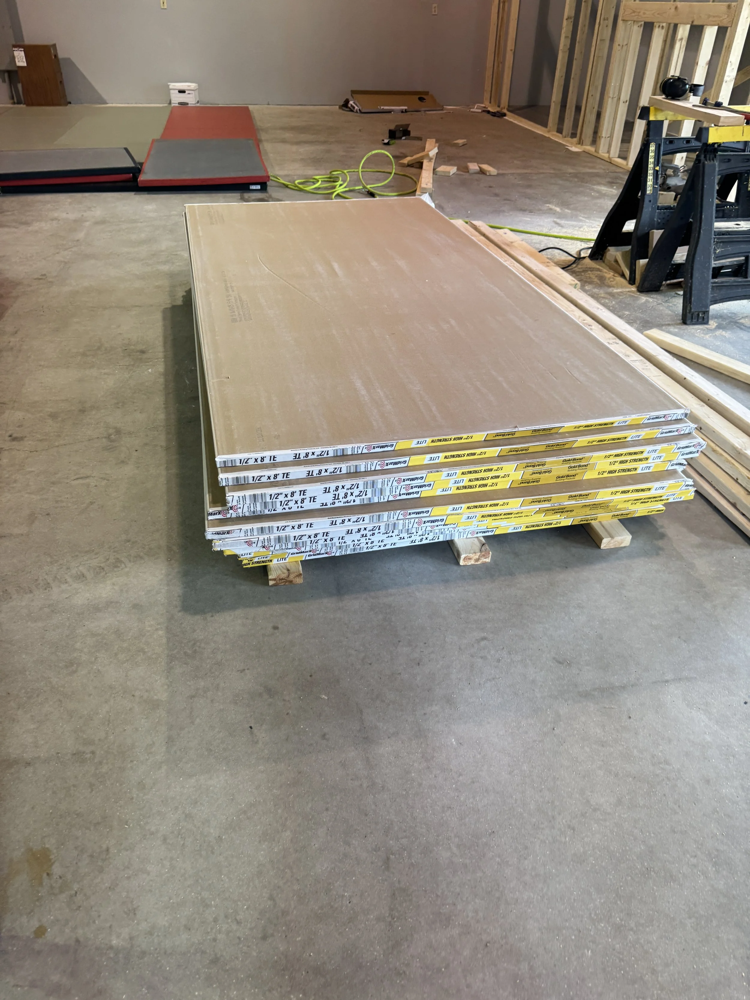
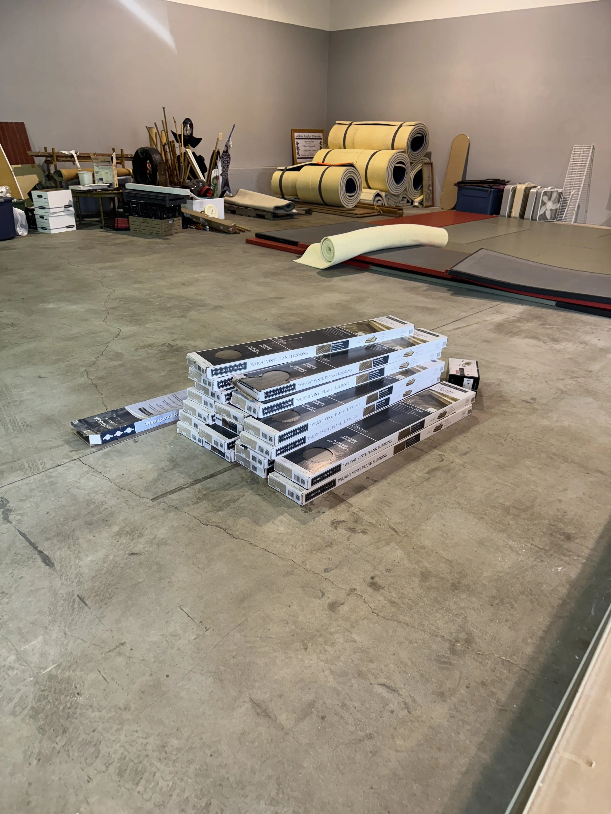
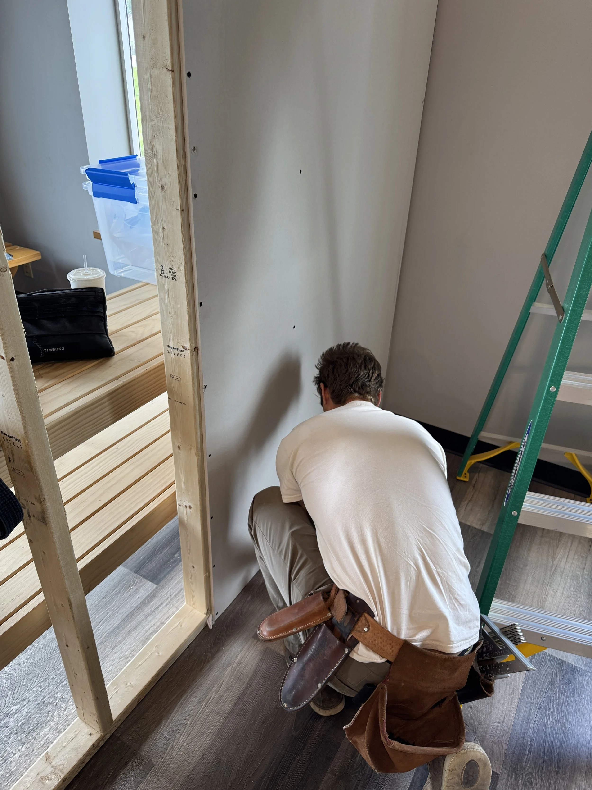
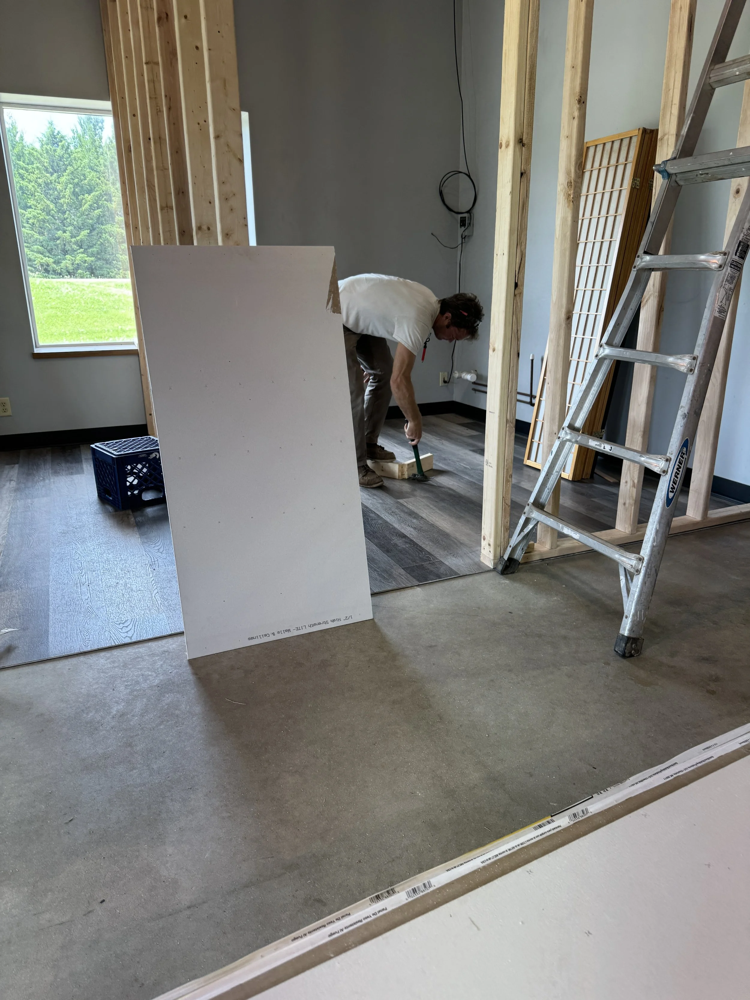
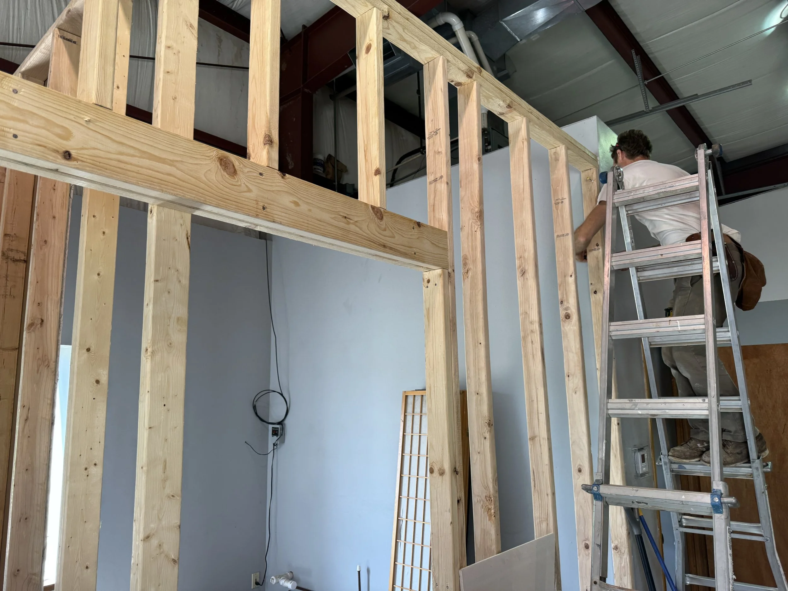

#### We were busy this week!

We purchased a ton of lumber to build two changing rooms, one office, and one storage closet. We also picked up several sheets of drywall, a bucket of nails, screws, and flooring for the parts of the dojo not covered by mats.

We purchased a moisture barrier to place between the bare concrete floor and the mats, along with padding foam. A monkey wrench was thrown our way when we discovered that the mats I purchased a year ago didn’t quite match the ones we inherited from Aikido of Harvard. Fortunately, a 1/4” plywood board is all we need to ensure the mats sit flush against each other.

After a week of work, we’ve raised the frames for the two changing rooms, the office, and the storage closet. We’ve also hung enough drywall to make the changing rooms usable. We’re aiming to hold informal class in our new space tomorrow evening!

Things left to do:
• Hang the remaining drywall on the outside of the changing rooms and office

• Install the flooring

• Lay the moisture barrier, plywood (where needed), padding, and mats

• Build the L-shaped wooden brace to keep the mats from shifting

Please enjoy the pictures of our space and wish us luck. We are going to need it!

::: {.photo-grid}
{.lightbox group="buildout-week-1"}

{.lightbox group="buildout-week-1"}
{.lightbox group="buildout-week-1"}
{.lightbox group="buildout-week-1"}
{.lightbox group="buildout-week-1"}
{.lightbox group="buildout-week-1"}

:::

