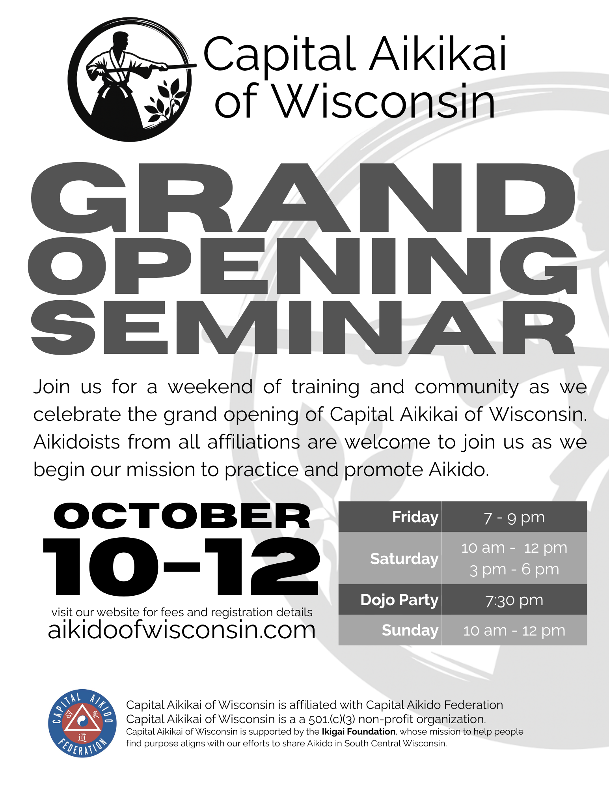

It's hard to believe we are about to open our doors to the public....

It took a lot of scouting to find a place that could host the dojo. We went through many floor plans to turn an empty box into our dream dojo. We built changing rooms, a little office and storage space. This week we are sanding and painting. The space is definitely starting to look like a dojo!

Our plan is to have a soft opening the 1st of September. That will give us a month to find our dojo legs and take care of all the details that will, for sure, pop up. 

To mark this occasion, we’re hosting a weekend of training and community with guest instruction from senior Aikido teachers visiting from all around the country. We would love if you would attend. 

**Schedule & Format**

Classes will run throughout the weekend from Friday evening through Sunday and led by experienced aikidoists who will each share their own approach to the art.  

We thought this would be a great way to learn, connect, and practice with others from inside and outside the region. A detailed schedule will be posted closer to the event.   

All classes are open to the public to observe free of charge.  

**Saturday Dinner**

On Saturday evening at 7:30 PM, we’ll host a dinner at the dojo for all registered participants.   
Food and drinks will be provided. It’s a chance to unwind, share a meal, and enjoy each other’s company.

**Accommodations** 
AmericInn has discounted rooms for aikidoists coming to the Grand Opening. You can use [this link to make your reservation][1] or call them directly at 608-756-4511. Refer to group code CAOA and group name is Capital Aikikai of Wisconsin.

[1]: https://www.wyndhamhotels.com/americinn/janesville-wisconsin/americinn-janesville/rooms-rates?adults=1&brand_id=AA&checkInDate=10%2F10%2F2025&checkOutDate=10%2F12%2F2025&children=0&cid=PS%3Aqas58ay4az58ydx&groupCode=caoa&iata=00093763&loc=ChIJ2zkiTZIXBogRwL7NH3a0-ws&referringBrand=WR&rooms=1&sessionId=1745598634&useWRPoints=false

**Registration Fee**

- All weekend: $120
- Friday $45
- Saturday $80
- Sunday $45

We will collect fees the during the seminar. We have to figure what is the best way to do that. Processing fees were not a thing I knew about before starting the dojo.  

If the fee is a barrier, please reach out—we want to make this seminar accessible to all who want to attend.

**Registration**

Please register ahead by [completing this form][2]. We’ll post more details, including class times, in the coming weeks.

[2]: https://docs.google.com/forms/d/e/1FAIpQLSdFx3IWH6NHPgMvxu88Pex6oVMgL0Zh4mOJdimXuYRXr_u4BA/viewform?usp=dialog

We’re looking forward to training with you and sharing our new space with our broader Aikido community.

{#fig-id width="500px" height="375px" fig-align="center" fig-alt="a flyer with information regarding CAoW's grand opening"}
