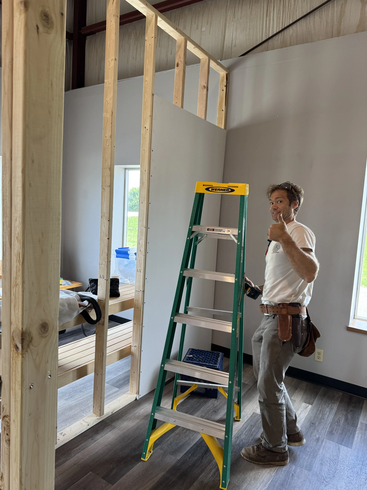
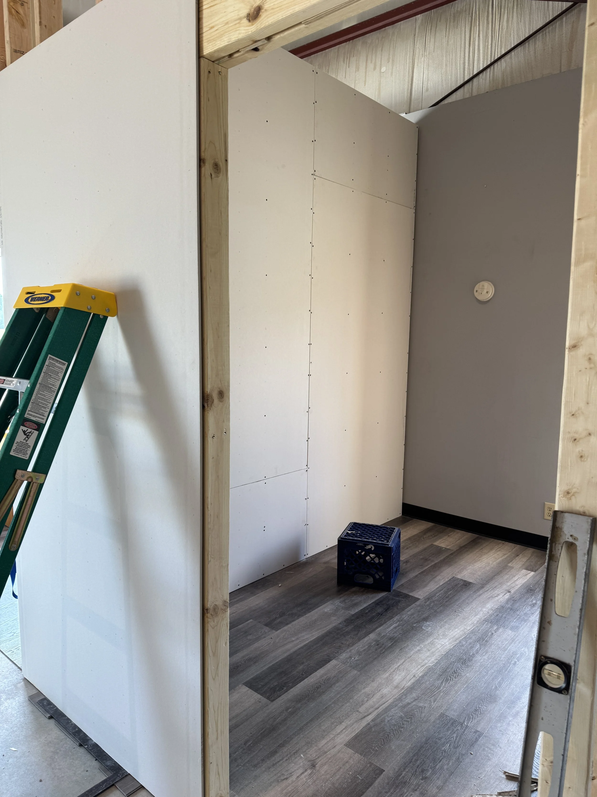
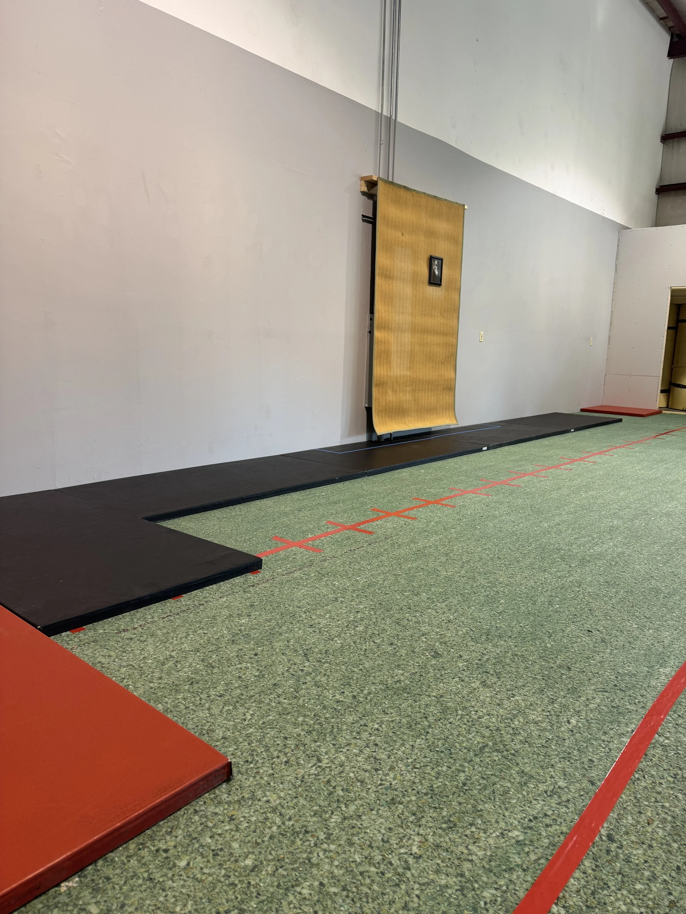
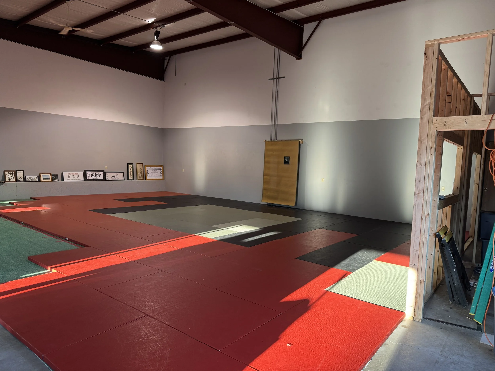
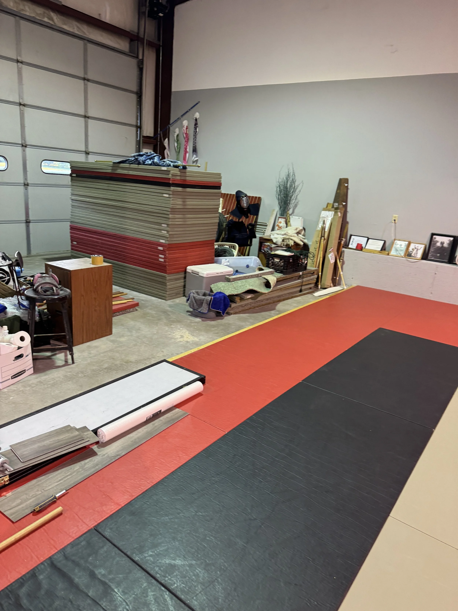

#### We continue to be busy!

We raised the frames for the changing rooms, office, and storage room next to the mat area. Much of the drywall is up, though there’s still plenty of work left to do.

We purchased eight rolls of carpet padding and laid them across the entire mat space. After settling on a pattern for our three mat colors, we placed the mats down and even held a few informal classes in the new space. Taking ukemi on these mats feels like falling on feathers!

One of the things I’ve enjoyed most is the temporary shomen we set up. It’s a simple woven carpet made of natural fibers, but what makes it so special to me is its history—it served as the focal point of the shomen at Aikido of Harvard for nearly 25 years and now it has been entrusted to me. I hope it watches over our practice for another 25 years.

::: {.photo-grid}
{.lightbox group="post-slug"}
{.lightbox group="post-slug"}
{.lightbox group="post-slug"}
{.lightbox group="post-slug"}
{.lightbox group="post-slug"}
:::

