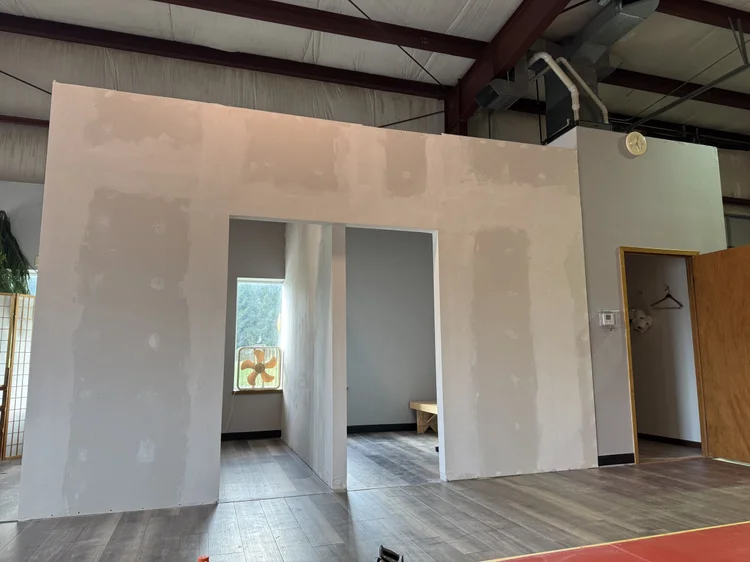
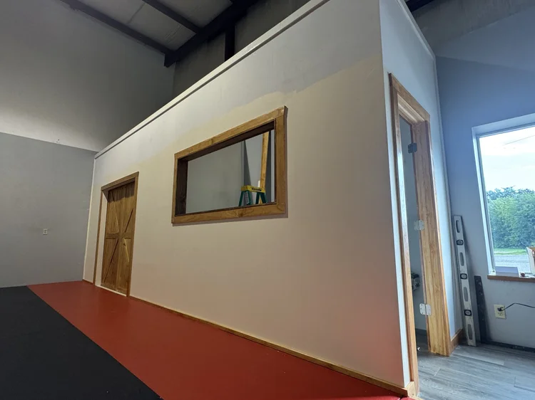
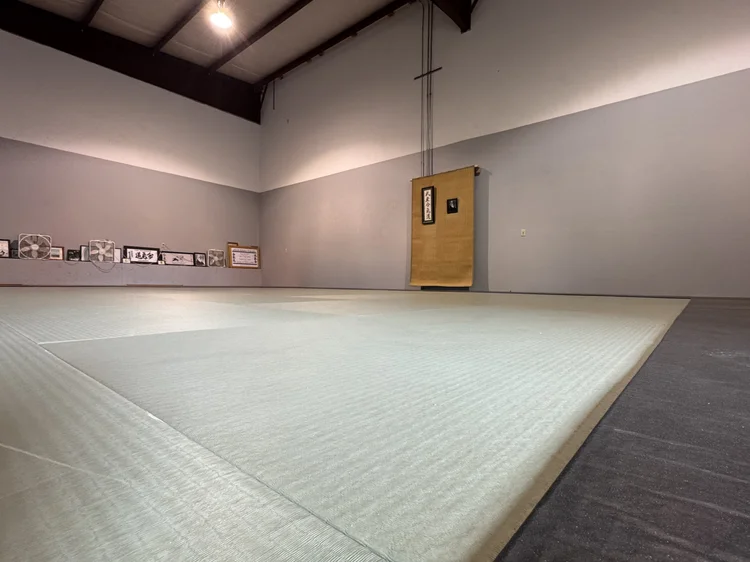

We are now moving into the beautifying phase of building the dojo: the walls are built and the mat’s frame is in place with padding under the tatami mats. 

We are priming the walls, then we’ll paint them. We have trimmings to stain and seal. We have to install shelves and hooks in the dressing rooms. 

We still have to install the kitchenette and a water fountain. Figuring out the social/watching area that’s next to the garage door is going to take some time. 

The most difficult part will be to find a new home for all the mementos that I inherited from my teacher, Terry Leonard. He has entrusted me to display and share all the treasures he has collected. I can’t wait for people to come visit the new space.

If you haven't heard, we are aiming to open the dojo’s doors to the public on September 1st. Please come visit, hopefully you’ll stay and train. 

::: {.photo-grid}
{.lightbox group="week5-7"}
{.lightbox group="week5-7"}
{.lightbox group="week5-7"}

:::
