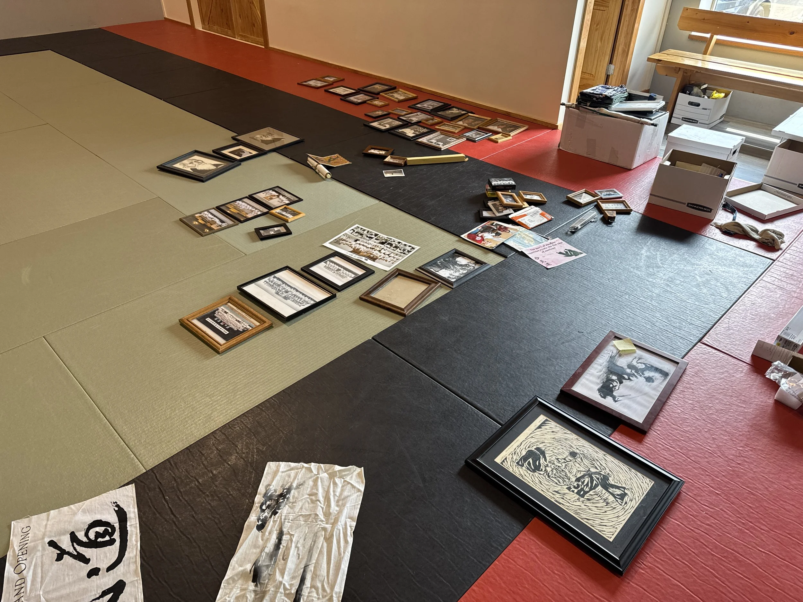

This week, I found myself unpacking boxes—not just any boxes, but ones filled with over four decades of Aikido.

Photographs. Handwritten notes. Seminar flyers from another era. Framed certificates, folded hakama, and candid snapshots of tired, smiling faces after long hours on the mat. These are the mementos entrusted to me by my instructor, Leonard Sensei.

To hold these objects is to hold time itself. Each image tells a story—not just about technique, but about commitment, laughter, hardship, and community. These aren’t museum pieces. They are living reminders of the path we walk in Aikido, and of the generations who’ve helped shape it—and continue to shape it today.

I don’t take this responsibility lightly. Leonard Sensei has poured so much of his life into this art and into the people he’s trained with over the years. Being entrusted with this archive is humbling. It’s a quiet gesture that says, “Carry this forward.” And that’s what I intend to do as our new dojo prepares to open its doors this week.

In the months ahead, I hope to share some of these moments with you—through photos, reflections, and stories that have made their way into these boxes. These memories don’t belong to me alone. They’re part of our shared Aikido journey, and I believe they still have much to offer us as we begin this new chapter together.

See you on the mat.

—Erwin

{#fig-id width="500px" height="375px" fig-align="center" fig-alt="Pictures scattered on the mats"}
