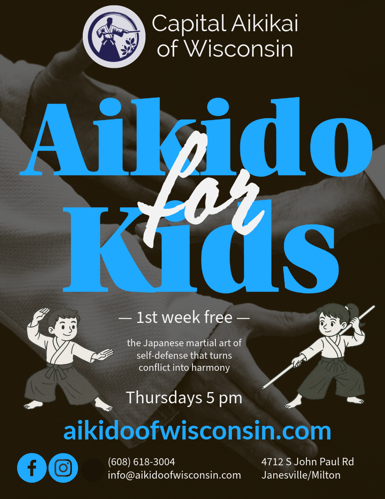

We’re excited to announce the start of a new Aikido class just for kids! Beginning this Thursday, class will meet from 5:00–6:00 pm at Capital Aikikai of Wisconsin. The class will be led by Johnson Sensei, who already has two committed students ready to take their first steps on the mat.

Aikido offers younger students more than just physical activity. Through practice, kids learn balance, coordination, and body awareness while also developing focus, patience, and respect for others. The training environment encourages cooperation rather than competition, helping children build confidence and resilience in a supportive community.

If you know a child who would benefit from movement, discipline, and fun in a safe setting, we invite them to join us this Thursday and see what Aikido is all about.

{#fig-id width="500px" height="375px" fig-align="center" fig-alt="a black, blue, and white poster with the illustration of two kids announcing aikido classes for kids"}
