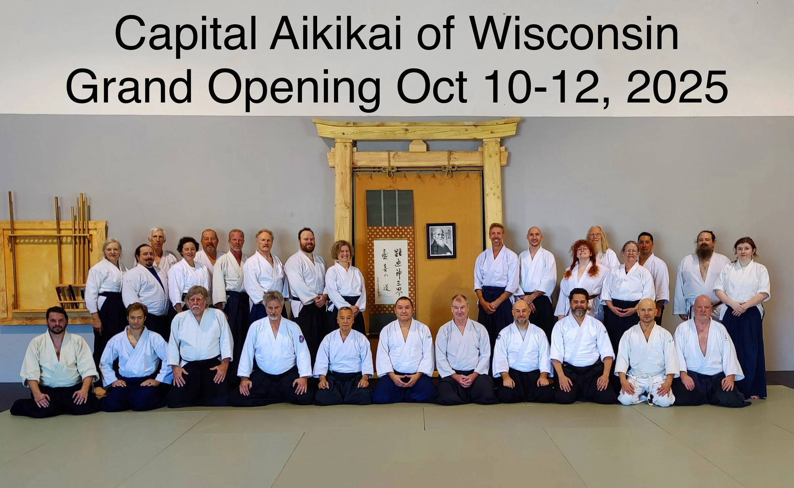

Our Grand Opening weekend was a wonderful success—filled with energy, connection, and shared purpose. We were honored to welcome aikidoists from across the United States who came together to celebrate the opening of our new dojo in Janesville.

Training throughout the weekend centered on one of Aikido’s most subtle and essential ideas: atemi. Several visiting instructors shared their perspectives on this concept, each illuminating different facets of timing, intent, and connection. The exchange of ideas—on and off the mat—was both lively and inspiring.

In true dojo fashion, the finishing touches came down to the wire. Our shōmen torii gate was raised just one day before the event, standing as a symbol of welcome and renewal. The shōmen was crafted by Scott Johnson from a sketch I gave him a few months ago. He diligently studied traditional Japanese joinery, resulting in a torii gate made entirely from white pine and spruce—without a single nail or screw.

During the weekend, we also shared the story of a remarkable gift: a calligraphy scroll originally given by Funakoshi Sensei to Leonard Sensei, and now passed on to Lares Sensei. The scroll bears the brushwork of Ō-Sensei Morihei Ueshiba himself—the founder of Aikido—a living link to the art’s origins and to the spirit we strive to uphold in our training.

We are deeply grateful to everyone who joined us—those who traveled great distances, lent a hand in preparation, or simply showed up with open hearts and curious minds. This weekend marked not just the opening of a building, but the beginning of a new chapter for Aikido in our community.

{#fig-id width="500px" height="375px" fig-align="center" fig-alt="A group of aikidois posting for a group picture"}