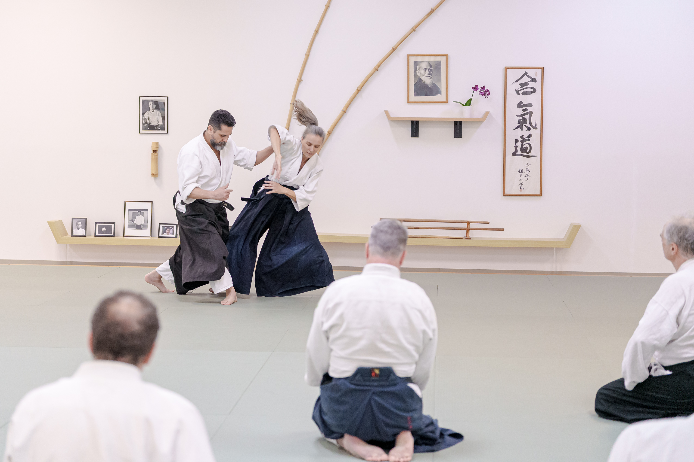
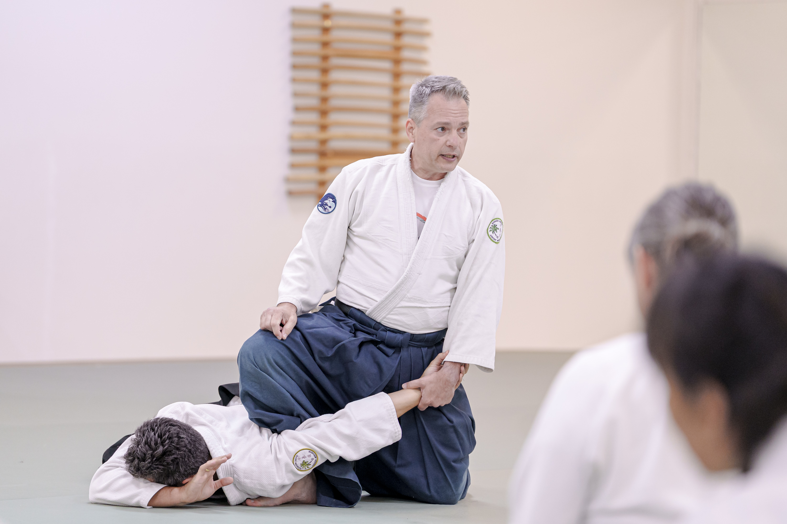
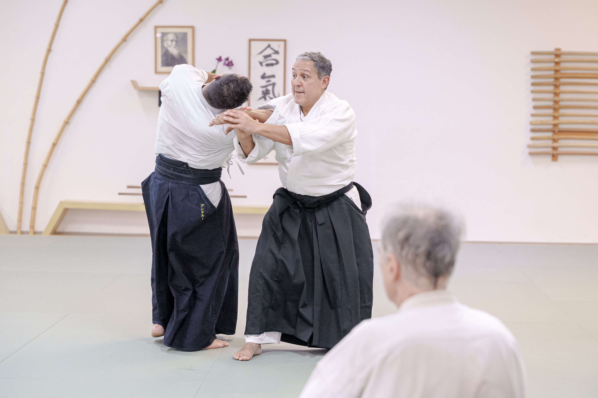
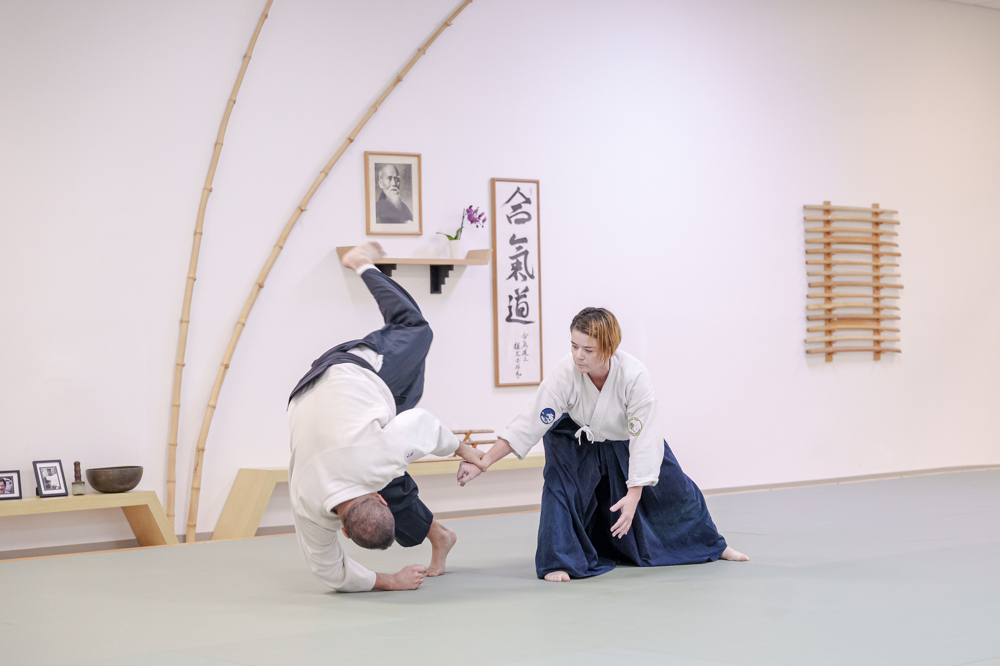
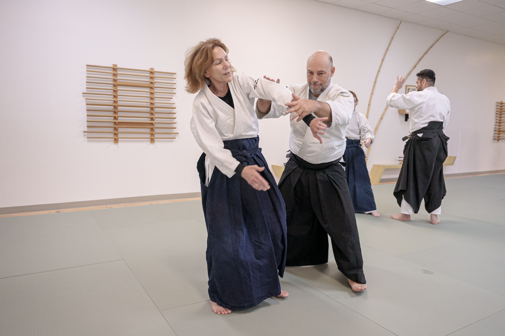
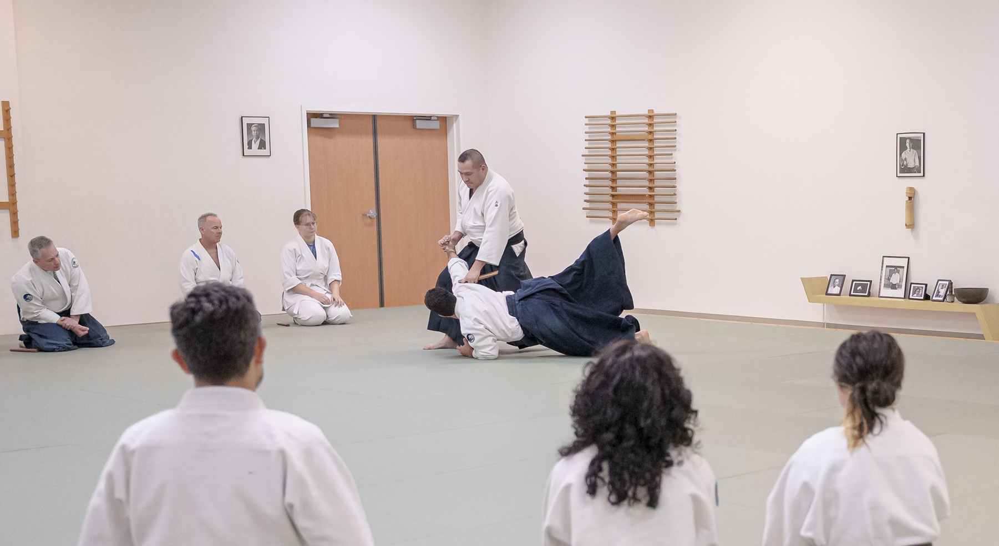
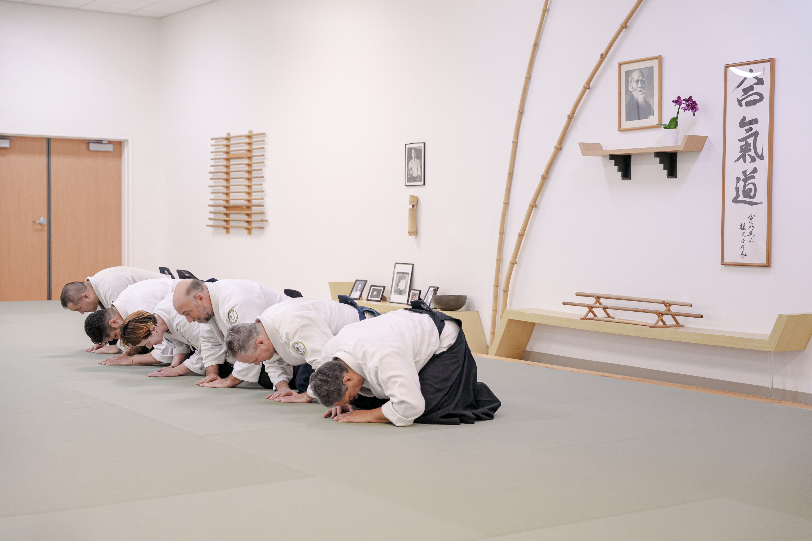

## What happened 

On June 24, 2026, two earthquakes of magnitude 7 or greater struck northwestern and central Venezuela. Both were large strike-slip events, and together they have killed more than 4,400 people and injured over 16,700. Recovery efforts are still underway as I write this, and I suspect, unfortunately, that the death toll will continue to climb before it settles.

## What we did 

A number of us in this aikido community are Venezuelan, or have family and friends there, across dojos in Florida, Wisconsin, and beyond. When something like this happens to a place you're from, there isn't much of a decision to make — you do what you can. The idea of a fundraising seminar went out to a few dojos, with the plan that whatever was raised would go directly to relief efforts. We decided to funnel the funds through [Global Empowerment Mission (GEM)](https://www.globalempowermentmission.org/), an organization with an established track record of getting aid to disaster zones quickly.

The idea didn't need much convincing behind it. Florida Aikikai, Aikido Miramar, Kenosha Aikikai, and our own dojo all said yes almost as soon as it was asked, and that's really the point worth making here: the sense of duty behind this wasn't any one person's. It was already there, shared across a lot of people, waiting for a reason to act on it.

Florida Aikikai offered their dojo and handled much of the on-the-ground logistics, and Peter and Penny Bernath in particular made sure instructors and students arriving from out of town had what they needed. That kind of practical generosity — opening a space, sorting out the details — doesn't always get mentioned, but it's usually what makes an effort like this possible in the first place.

## The seminar

The mat was full that Saturday. People trained, and in doing so, gave their time toward something beyond the technique itself. Some couldn't make the trip and gave online instead in the days around the event. Between the two, the community raised close to $10,000 — most of it, as it happens, in the final few days as word reached more people. Seventy-two separate donations went into that total, and most were modest, in the range of $100 to $150. I think that's worth noting on its own: this wasn't one or two large gifts carrying the total, but a lot of people independently deciding it was worth doing something.

```{r}
#| echo: false
#| include: true
#| message: false
#| warning: false

library(dplyr)
library(ggplot2)

data <- read.csv("aikido-solidarity-venezuela.csv")

cumulative_df <- data |>
  filter(amount > 0) |>
  mutate(date = as.Date(date),
         date = if_else(date == as.Date("2006-07-12"), as.Date("2026-07-12"), date)) |>
  group_by(date) |>
  summarise(daily = sum(amount), .groups = "drop") |>
  arrange(date) |>
  mutate(cumulative = cumsum(daily))


cumulative_df <- tibble(
  date = as.Date(c(
    "2026-06-26", "2026-06-27", "2026-06-28", "2026-06-29", "2026-06-30",
    "2026-07-02", "2026-07-03", "2026-07-05", "2026-07-06", "2026-07-07",
    "2026-07-08", "2026-07-09", "2026-07-10", "2026-07-11", "2026-07-12"
  )),
  cumulative = c(150, 485, 835, 1050, 1100, 1154, 1334, 1354, 1745,
                 1825, 2125, 2600, 4747, 8157, 9657)
)

ggplot(cumulative_df, aes(x = date, y = cumulative)) +
  geom_area(fill = "#2a78d6", alpha = 0.1) +
  geom_line(color = "#2a78d6", linewidth = 1) +
  geom_point(color = "#2a78d6", fill = "white", shape = 21, size = 2, stroke = 1) +
  scale_y_continuous(labels = scales::dollar_format()) +
  scale_x_date(date_labels = "%b %d") +
  labs(x = NULL, y = "Cumulative total") +
  theme_minimal(base_size = 13) +
  theme(
    panel.grid.minor = element_blank(),
    panel.grid.major.x = element_blank()
  )

bin_labels <- c("0-25", "25-50", "50-75", "75-100", "100-150",
                 "150-200", "200-300", "300-500", "500+")
bin_breaks <- c(0, 25, 50, 75, 100, 150, 200, 300, 500, Inf)

hist_df <- data |>
  filter(amount > 0) |>
  mutate(bin = cut(amount, breaks = bin_breaks, labels = bin_labels, right = FALSE)) |>
  count(bin, name = "count")

ggplot(hist_df, aes(x = bin, y = count)) +
  geom_col(fill = "#1baf7a", width = 0.7) +
  labs(x = "Donation Amount", y = "Count") +
  theme_minimal(base_size = 13) +
  theme(
    panel.grid.minor = element_blank(),
    panel.grid.major.x = element_blank(),
    axis.text.x = element_text(angle = 45, hjust = 1)
  )

```

I'm grateful to everyone who trained, gave, or helped in some smaller way I may not even know about. I'd also like to thank our photographer, @wmeleanfoto on Instagram, for documenting the day.

I don't think any of this needs much more said about it. A place we care about was hit hard, and people showed up. That's the whole story.

*#Venezuela #Aikido #FloridaAikikai #CapitalAikikaiofWisconsin #AikidoMiramar #KenoshaAikikai*


::: {.photo-grid}
{.lightbox group="post-slug"}
{.lightbox group="post-slug"}
{.lightbox group="post-slug"}
{.lightbox group="post-slug"}
{.lightbox group="post-slug"}
{.lightbox group="post-slug"}
{.lightbox group="post-slug"}
:::


