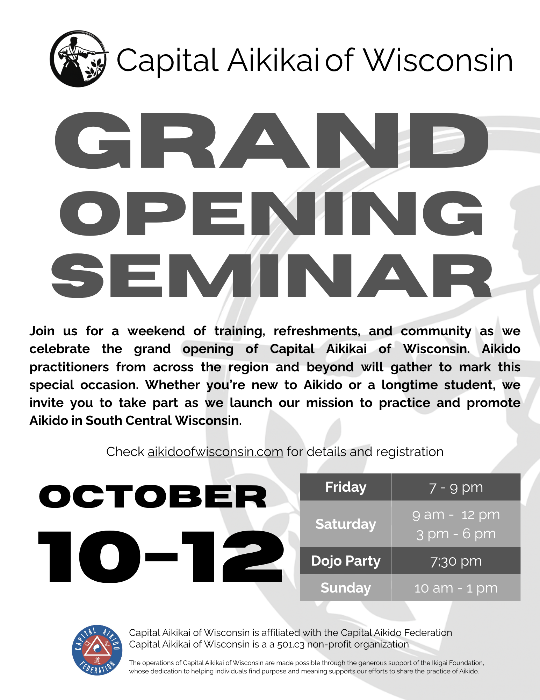

We’re happy to invite you the Grand Opening of Capital Aikikai of Wisconsin.
To mark the occasion, we’re hosting a weekend of training and community with guest instruction from senior Aikido teachers visiting from all around the country.

**Schedule & Format**

Classes will run throughout the weekend from Friday evening through Sunday and led by experienced aikidoists who will each share their own approach to the art.
We thought this would be a great way to learn, connect, and practice with others from inside and outside the region. A detailed schedule will be posted closer to the event.
All classes are open to the public to observe free of charge.

**Saturday Dinner**

On Saturday evening at 7:30 PM, we’ll host a dinner at the dojo for all registered participants.
Food and drinks will be provided. It’s a chance to unwind, share a meal, and enjoy each other’s company.

Accommodations AmericInn has discounted rooms for aikidoists coming to the Grand Opening. You can use this link to make your reservation or call them directly at 608-756-4511. Refer to group code CAOA and group name is Capital Aikikai of Wisconsin.

**Registration Fee**

- All weekend: $120  
- Friday $45  
- Saturday $80  
- Sunday $45  

If the fee is a barrier, please reach out—we want to make this seminar accessible to all who want to attend.

Registration

Please register ahead by completing this form. We’ll post more details, including class times, in the coming weeks.

We’re looking forward to training with you and sharing our new space with our broader Aikido community.

