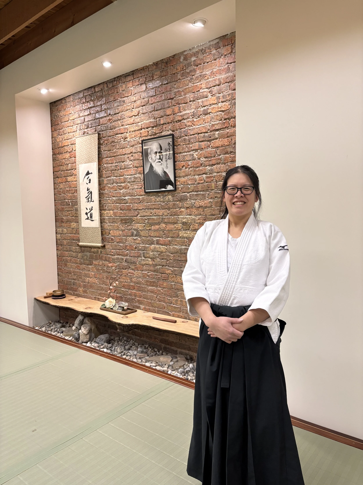

We’re thrilled to announce that Christine Leung Sensei will be leading our Friendship Seminar on Tuesday, March 24, 2026.

If you attend aikido events anywhere near Milwaukee, Madison, or Chicago, you’ve likely met Christine. She’s a dedicated practitioner who consistently shows up to support the aikido community.

Christine is a warm and friendly presence on the mat—and truly a pleasure to practice with. Please join us and experience what a treat it will be to have her lead class.

####Meet Christine Leung Sensei 

Christine has been practicing Aikido since 2014 and currently holds the rank of Shodan. She began her Aikido practice at Aikido of West Bend. She currently trains at Kenosha Aikikai under Rock Lazo Shihan and the dojo is affiliated with the United States Aikido Federation.

Along with training in Aikido, Christine also practices a Wu style Tai Chi at the Chinese Kung Fu Center and is an assistant instructor in Tai Chi

{#fig-id width="500px" height="375px" fig-align="center" fig-alt="Christine Leung, an aikidoist posing in from of an aikido shomen"}
