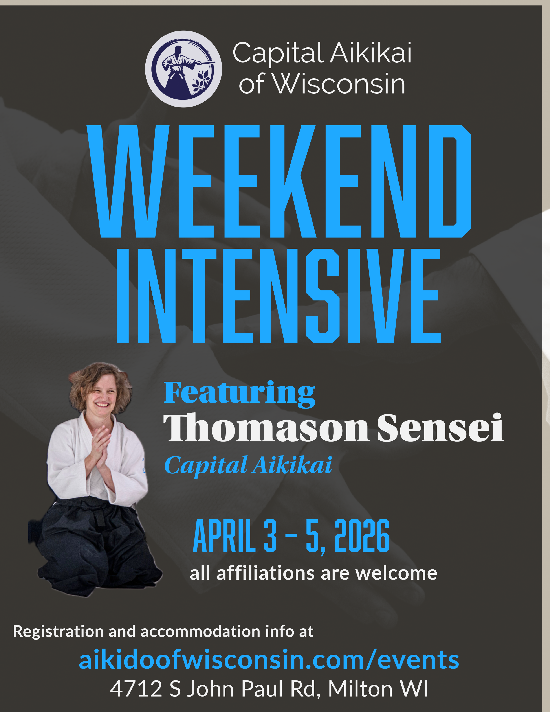

##About our guest instructor

Lucy Thomason Sensei started Aikido in October of 1995 at Capital Aikikai in Silver Spring, Maryland, under Clyde Takeguchi Shihan. She has trained with him ever since.

Thomason Sensei also travels extensively and rarely misses a chance to train with Aikidoka in other regions.

For our dojo, her long relationship with Takeguchi Sensei—combined with the breadth of her training—makes this visit especially meaningful. We’re looking forward to experiencing Takeguchi Sensei’s Aikido through Thomason Sensei’s lens: the details she’s absorbed over decades, the way she’s tested those ideas across different partners and dojos, and the clarity that comes from carrying a teacher’s principles while also making them her own.

Registering ahead of time helps us plan the mat space, staffing, and refreshments—so everyone has a smooth, welcoming weekend. If you know you’re coming, please sign up in advance. Register here.

We’ve reserved a discounted room block (with late checkout) at the AmericInn by Wyndham Janesville. Please book through the group block using this link, or call 608-371-9981 and reference group code CAOW. The discounted rate is available until one month before the event. You can reserve now and pay at the hotel.

We want Aikido to be accessible to everyone. If registration fees are a barrier, please reach out to info@aikidoofwisconsin.com—scholarship options are available.

{#fig-id fig-align="center" fig-alt="A black, blue, and white flyer announcing the details of the seminar with Thomanson sensei in a seated seiza position"}

