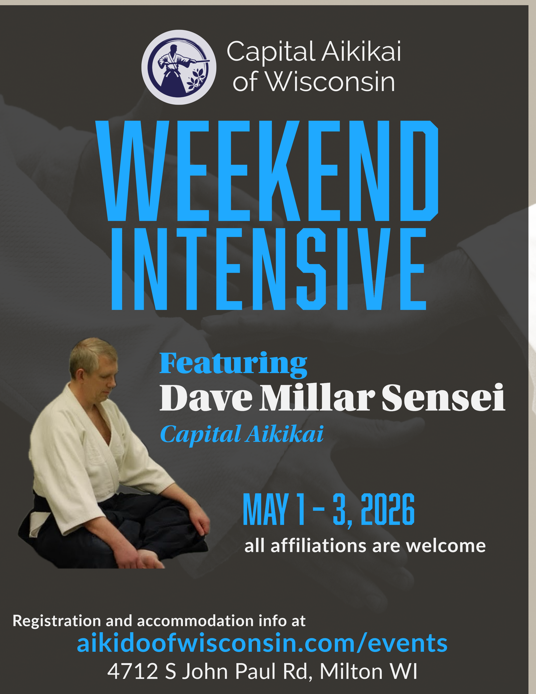

#### About our Guest Instructor

Dave started aikido in college in 1981, where he practiced under Ralph Pettman Sensei and senior students of Shuji Maruyama Sensei. He moved to Washington, DC, for work in 1987 and began studying with Clyde Takeguchi Sensei.

For attendees, this is a chance to experience Takeguchi Sensei’s Aikido through Dave’s lens: the principles he’s absorbed over decades, the way he’s tested them with countless partners, and the practical details that make technique work cleanly across different body types and skill levels. Expect an emphasis on fundamentals that hold up—connection, distance, timing, and simple, repeatable mechanics you can take back to your own practice immediately.

He has trained at Capital Aikikai ever since, with the exception of a three-year stint in Japan. He teaches regularly (including the kids’ class for many years) and holds the rank of rokkudan.

#### Logistics

Registering ahead of time helps us plan the mat space, staffing, and refreshments—so everyone has a smooth, welcoming weekend. If you know you’re coming, please sign up in advance. Register here. 

We’ve reserved a discounted room block (with late checkout) at the AmericInn by Wyndham Janesville. Please book through the group block using this link, or call 608-371-9981 and reference group code CAOW. The discounted rate is available until one month before the event. You can reserve now and pay at the hotel.

We want Aikido to be accessible to everyone. If registration fees are a barrier, please reach out to info@aikidoofwisconsin.com—scholarship options are available.

{#fig-id fig-align="center" fig-alt="A black, blue, and white flyer with seminar details and a seated picture of Dave Millar sensei"}