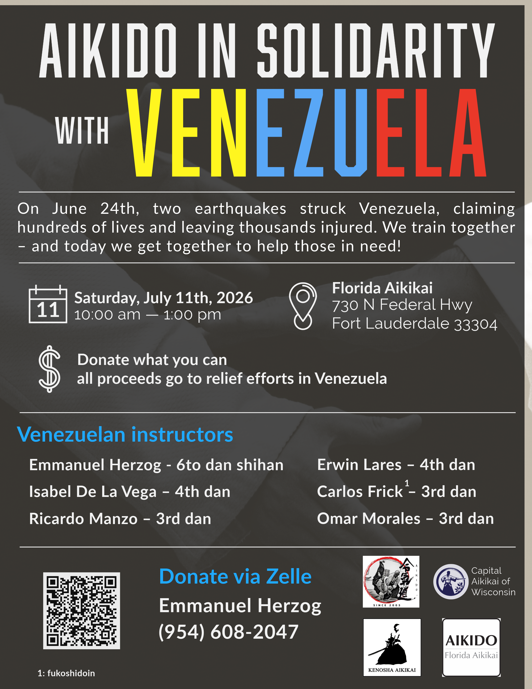

On June 24th, two earthquakes struck Venezuela, claiming hundreds of lives and leaving thousands more injured. Like many of you, we felt the weight of that news and wanted to respond in a way that feels true to who we are — by training together, and by helping.

A group of Venezuelan aikidoists is organizing a charity seminar, and Capital Aikikai of Wisconsin is proud to be part of it. Our friends at Florida Aikikai have generously opened their dojo in Fort Lauderdale to host the event, and we want to invite our whole community — students, instructors, and friends of the dojo — to join us on the mat and in intention.

The seminar takes place on Saturday, July 11th, from 10:00 am to 1:00 pm at **Florida Aikikai, 730 N Federal Hwy, Fort Lauderdale, FL 33304.** Leading the practice will be a group of Venezuelan instructors: Emmanuel Herzog (6th dan shihan), Erwin Lares (4th dan), Isabel De La Vega (4th dan), Ricardo Manzo (3rd dan), Carlos Frick (3rd dan), and Omar Morales (3rd dan). It is going to be a special mat.

All proceeds go directly to earthquake relief efforts in Venezuela. Donate what you can. If you can't make the trip south, you can still contribute via Zelle to Emmanuel Herzog at (954) 608-2047.

We hope to see you there.

