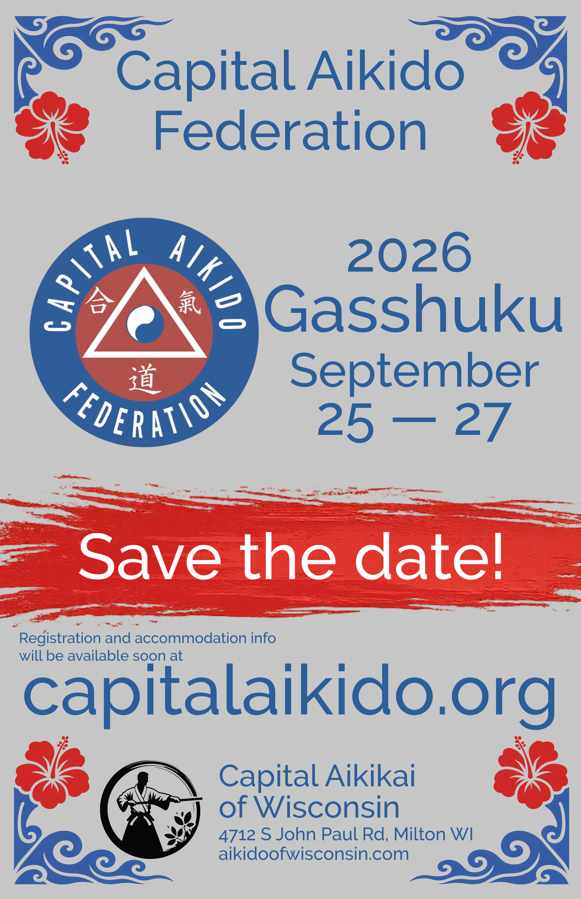

```{=html}
<div class="gasshuku-layout">
  <div class="gasshuku-text">

    <h1>CAF Annual Gasshuku<br>Comes to the Midwest!</h1>

    <p>
      The <a href="https://www.capitalaikidoblog.com"><strong>Capital Aikido Federation</strong></a>
      <strong>Annual Training Intensive</strong> is coming to the Midwest—and
      <a href="/">Capital Aikikai of Wisconsin</a> is honored to host.
    </p>

    <p>
      This is a big moment for our community. CAoW is one of the Federation's
      newest dojos, and we're excited (and a little awed) to welcome friends
      from across the region and beyond for a weekend of focused training, good
      energy, and shared practice.
    </p>

    <h2>What to expect</h2>

    <ul>
      <li><strong>High-quality Aikido training</strong> in a supportive,
      serious-but-friendly atmosphere</li>
      <li><strong>A gathering of friends</strong> —a chance to reconnect with
      familiar faces and meet new training partners</li>
      <li><strong>A Midwest milestone</strong> for the CAF Annual Intensive,
      hosted in Wisconsin</li>
    </ul>

    <h2>Everyone is welcome</h2>

    <p>
      Whether you're a long-time CAF member or visiting from another
      affiliation, <strong>all ranks and backgrounds are welcome</strong>.
      Bring your curiosity, your ukemi, and your best training spirit.
    </p>

    <h2>More details soon</h2>

    <p>
      We'll share the full schedule, registration info, and logistics shortly.
      For now: <strong>save the date</strong>, spread the word, and plan to
      join us as we bring this cornerstone CAF event to the Midwest for the
      first time.
    </p>

    <p><strong>We can't wait to train with you!</strong></p>

  </div>
  <div class="gasshuku-flyer">
    
  </div>
</div>
```