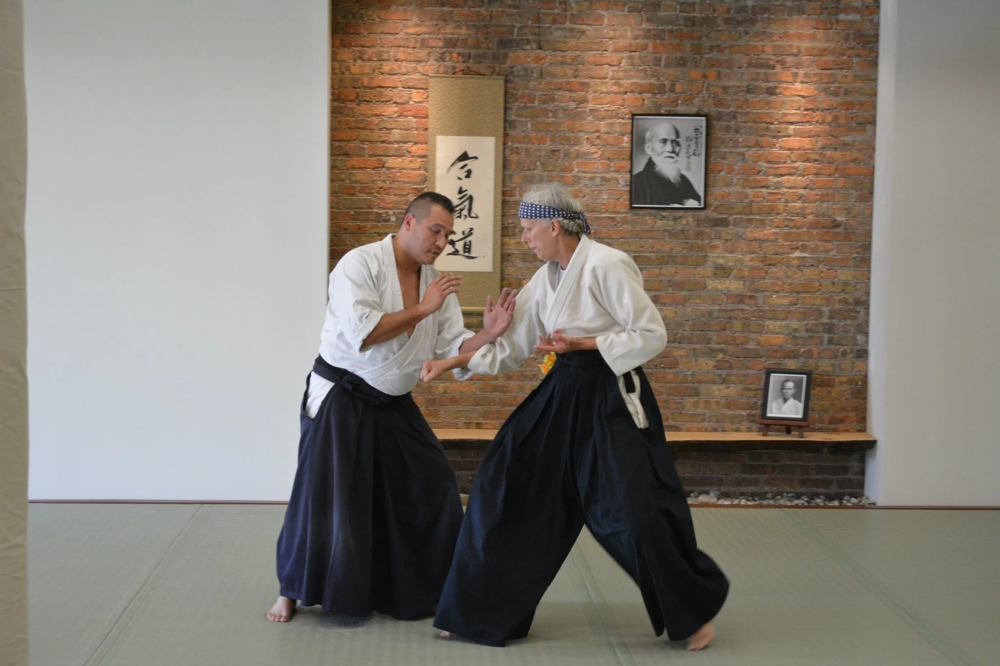
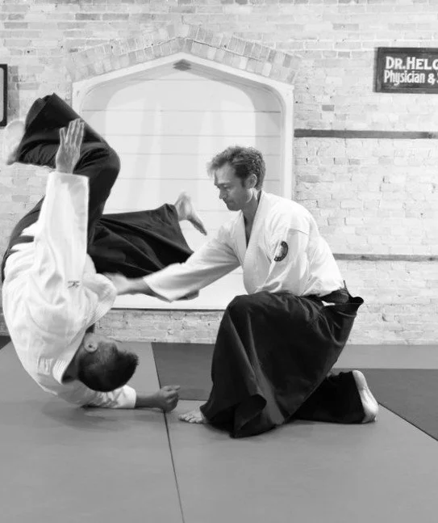
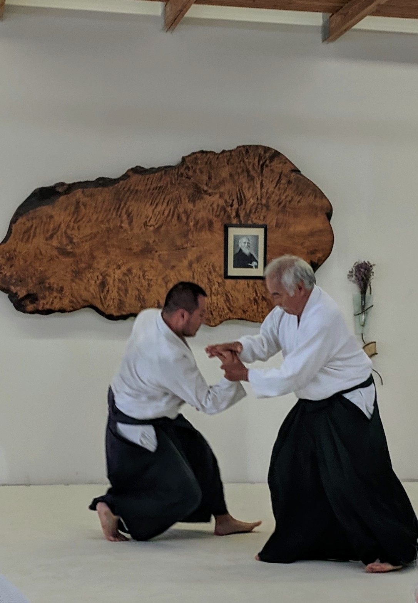
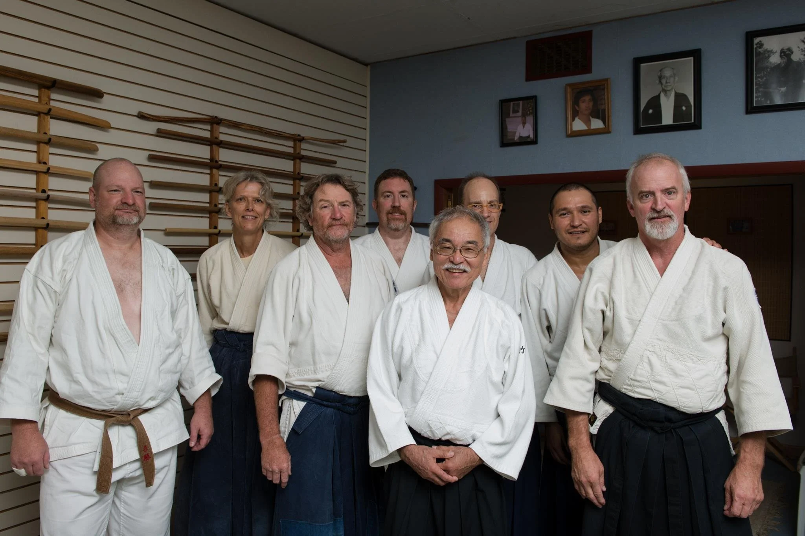

::: {.hero}
# Move with purpose.<br>Live with harmony

Learn Aikido for conflict resolution, self-defense,
and personal growth — on and off the mat.
:::

```{=html}
<div class="intro-block">
  
  <div class="intro-text">
    <p><strong>Welcome to Capital Aikikai of Wisconsin</strong></p>
    <p>
      <strong>Capital Aikikai of Wisconsin</strong> is a 501(c)(3) nonprofit
      organization dedicated to sharing and promoting the art of Aikido in
      Janesville, Wisconsin. As part of the
      <a href="https://www.capitalaikidoblog.com">Capital Aikido Federation</a>,
      we welcome people from all backgrounds who seek personal growth through
      this peaceful and dynamic martial art.
    </p>
    <p>
      Our training emphasizes de-escalation and resolving conflict without harm.
      Under the guidance of Lares sensei, we provide a welcoming, inclusive
      space where students build confidence, enhance physical skills, and
      cultivate a mindset rooted in harmony and respect — on and off the mat.
    </p>
    <p>
      Aikido is more than self-defense — it's a practice that fosters awareness,
      empathy, and resilience. We invite you to visit the dojo, watch a class,
      or step onto the mat for a free introductory session.
    </p>
    <a href="about/index.html" class="btn-cta">Learn More</a>
  </div>
</div>

<div class="photo-strip">
  
  
  
  
</div>
```
