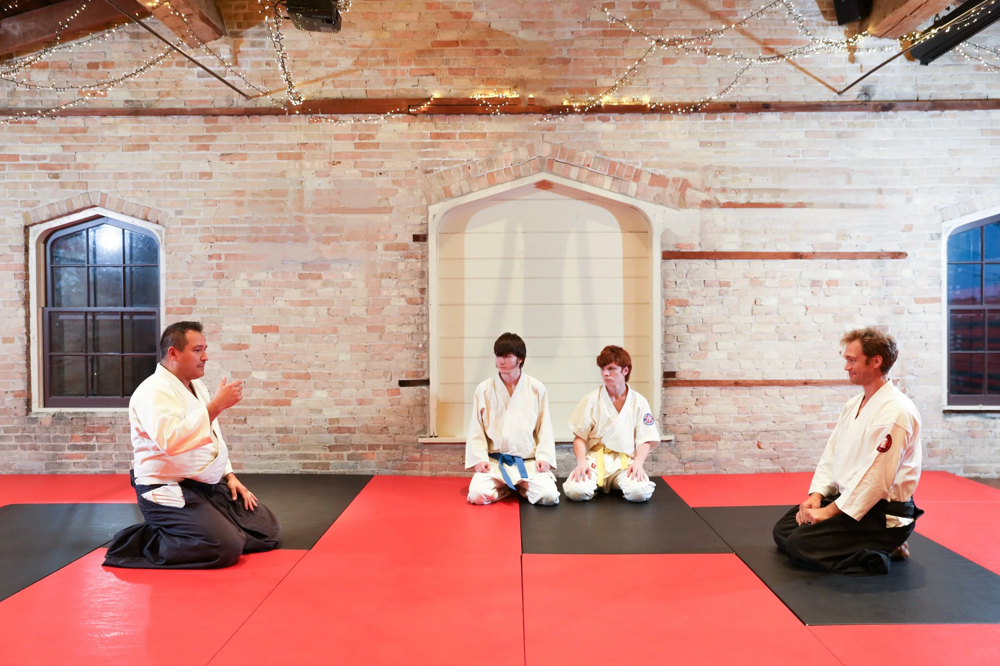

## Weekly Schedule

```{=html}
<div class="schedule-wrapper">
  <table class="schedule-table">
    <thead>
      <tr>
        <th></th>
        <th>Monday</th>
        <th>Tuesday</th>
        <th>Wednesday</th>
        <th>Thursday</th>
        <th>Friday</th>
        <th>Saturday</th>
        <th>Sunday</th>
      </tr>
    </thead>
    <tbody>
      <tr>
        <td class="time-col">5:00<br>–<br>5:50</td>
        <td></td>
        <td></td>
        <td></td>
        <td>Kids'<br>Class</td>
        <td></td>
        <td></td>
        <td></td>
      </tr>
      <tr>
        <td class="time-col">6:00<br>–<br>6:50</td>
        <td></td>
        <td>Iaido</td>
        <td></td>
        <td>Aikido<br>Beginners</td>
        <td></td>
        <td></td>
        <td></td>
      </tr>
      <tr>
        <td class="time-col">7:00<br>–<br>7:50</td>
        <td>Aikido<br>Beginners</td>
        <td>Aikido<br>Weapons</td>
        <td>Aikido<br>Beginners</td>
        <td>Aikido<br>Intermediate</td>
        <td></td>
        <td></td>
        <td></td>
      </tr>
      <tr>
        <td class="time-col">8:00<br>–<br>8:50</td>
        <td>Aikido<br>Intermediate</td>
        <td></td>
        <td>Aikido<br>Intermediate</td>
        <td></td>
        <td></td>
        <td></td>
        <td></td>
      </tr>
    </tbody>
  </table>
</div>

<div class="classes-intro">
  <div class="classes-intro-text">
    <p>
      Capital Aikikai of Wisconsin strives to provide a learning environment
      where students can explore the fundamental principles of aikido in
      relation to both mind and body. Through training, students are encouraged
      to discover which aspects of aikido resonate best with their individual
      strengths and preferences.
    </p>
  </div>
  <div class="classes-intro-image">
    
  </div>
</div>
```
